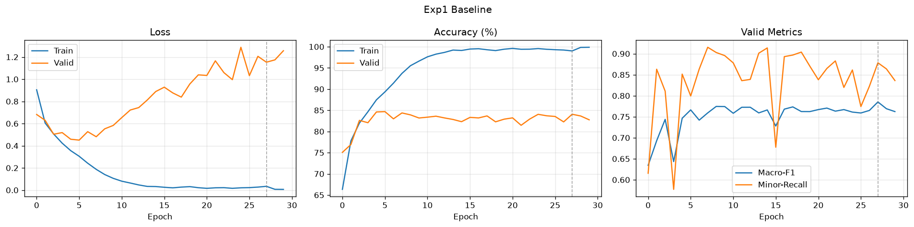
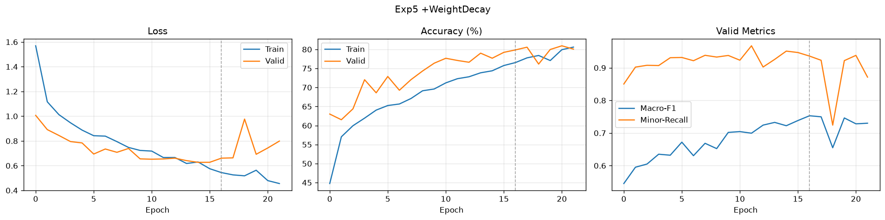
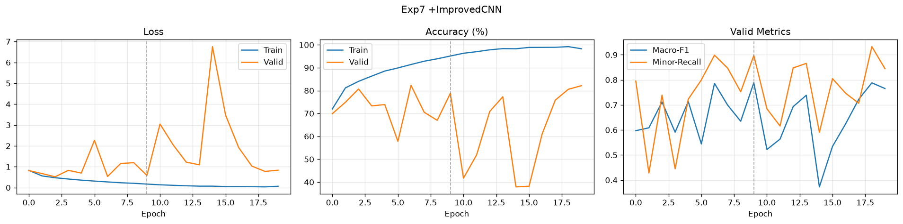
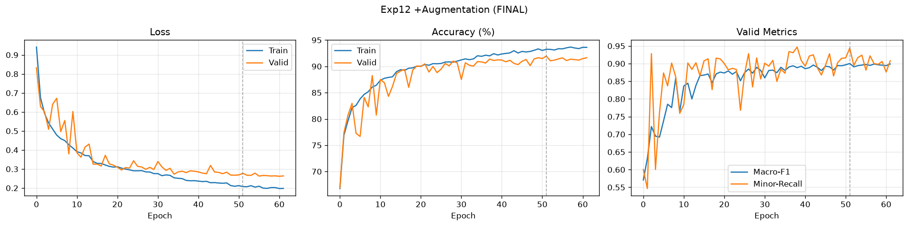

# 웨이퍼맵 불량 분류 CNN 최적화 보고서

| | |
| --- | --- |
| 작성자 | 황도희, 이소정 |
| 작성일 | 2026-08-07 |
| 요약 | 웨이퍼맵 불량 분류 CNN 최적화 실험 결과 및 해석 |
| 코드 | https://github.com/ahrdyrxkddhfl/SKALA_CNN-Optimization |

## 목차

1. [SUMMARY](#1-summary)
2. [최적화 배경 및 목표](#2-최적화-배경-및-목표)
3. [문제 정의 및 진단](#3-문제-정의-및-진단)
4. [최적화 전략](#4-최적화-전략)
5. [최적화 효과](#5-최적화-효과--무엇이-왜-효과가-있었는지)
6. [최적 성능](#6-최적-성능)
7. [실험 상세](#7-실험-상세)
8. [클래스별 Recall 상세](#8-클래스별-recall-상세-valid-기준)
9. [한계 및 향후 과제](#9-한계-및-향후-과제)
10. [부록](#10-부록)

---

## 1. SUMMARY

반도체 공정에서 불량 미검출 비용이 오검출보다 크다는 점을 고려하여, **Macro-F1 ≥ 0.75 및 희귀 불량 Recall ≥ 0.50**을 1순위 목표로 설정했다.

Baseline CNN은 Train 99.01% / Valid 84.06%로 **14.95%p의 일반화 격차**를 보였고, Scratch Recall이 0.214에 불과해 목표에 크게 미달했다. 전체 정확도가 특정 유형의 검출 실패를 은폐하고 있는 상태였다.

진단 결과 전체 파라미터 822,281개 중 **97.6%가 단일 FC 층에 집중**되어 있었고, Conv의 Receptive Field는 입력 64px 대비 **10px**에 불과했다. 웨이퍼맵 불량은 대부분 전역 패턴이므로, Conv가 전역 형태를 인식하지 못하고 FC의 위치 암기가 이를 대체하는 구조로 판단했다. 즉 원인은 모델 용량 과다가 아닌 **파라미터 배치의 구조적 결함**이다.

이 가설을 A, B 두 트랙으로 검증했다.

- **트랙 A(규제 중심)** 는 Macro-F1을 0.7914 → 0.7529로 악화시켰고, 실험 #5에서는 Train Accuracy(76.54%)가 Valid(79.87%)보다 낮은 과소적합에 도달하여 가설을 반증적으로 지지했다.
- **트랙 B(구조 재설계)** 는 Conv 4블록 + BatchNorm + GAP 구성으로 RF를 46px로 확대하고 파라미터를 71% 감축했으며, Scratch F1을 2.7배 개선했다. 이후 LR Scheduler로 학습을 안정화(+0.072)하고, 웨이퍼맵의 회전 대칭성을 활용한 데이터 증강으로 암기 가능성을 차단(+0.048)했다.

**최종 성능 (Test, 1회 평가): Accuracy 0.9140 / Macro-F1 0.8805 / Recall(mean) 0.8890 — 사전 설정 목표 5개 전부 달성**

Baseline 대비 Macro-F1 **+0.1253**, Train-Valid 격차 14.95%p → **1.29%p**이며 이때 Train Accuracy 93.24%가 유지되어 학습 능력을 희생하지 않고 암기만 제거했음을 확인했다. 병목 클래스 Scratch의 F1은 0.2563 → **0.8441(3.3배)** 로 개선되어, 진단이 지목한 지점이 실제 병목이었음이 검증되었다.

---

## 2. 최적화 배경 및 목표

### 2.1 비즈니스 맥락

반도체 제조에서 웨이퍼맵 불량 패턴은 공정 이상의 지문(fingerprint) 역할을 한다. Center는 스핀 코팅 편차, Edge-Ring은 식각 챔버 가장자리 이상, Scratch는 이송 과정의 기계적 접촉을 시사하는 식이다. 불량 유형을 정확히 분류하면 이상 설비를 신속히 특정하여 수율 손실을 최소화할 수 있다.

이 맥락에서 **미검출(False Negative)의 비용은 오검출(False Positive)보다 훨씬 크다.** 불량을 놓치면 결함 웨이퍼가 후속 공정을 그대로 통과해 누적 손실이 발생하지만, 정상을 불량으로 오판하면 재검사 비용에 그친다. 특히 Near-full은 웨이퍼 대부분에 결함이 분포하는 심각한 공정 이상이고, Scratch는 설비 점검으로 직결되는 신호이므로, **발생 빈도가 낮더라도 반드시 검출되어야 한다.**

따라서 본 최적화는 전체 정확도보다 **모든 불량 유형을 고르게 검출하는 능력**을 우선 목표로 설정한다.

### 2.2 최적화 목표 (우선순위 순)

| 순위 | 목표 지표 | 기준값 | 설정 근거 |
| --- | --- | --- | --- |
| 1 | Macro-F1 | ≥ 0.75 | 소수 클래스를 포함한 전 클래스를 동등 평가하는 종합 지표 |
| 1 | 희귀 불량 Recall (Near-full, Scratch) | ≥ 0.50 | 미검출 리스크 최소화 — 발생 시 공정 전반에 영향 |
| 2 | Accuracy | ≥ 0.90 | 전반적 분류 신뢰도 기준 |
| 3 | Train-Valid 격차 | ≤ 5%p | 과적합 해소 판단 기준 |

**Macro-F1을 1순위로 둔 이유.** 클래스 불균형이 최대 65:1(Edge-Ring 9,680 vs Near-full 149)이므로 Accuracy는 다수 클래스에 지배되는 허수 지표가 될 수 있다. 실제로 Baseline은 Accuracy 0.8270으로 양호해 보이지만 Scratch Recall이 0.214에 불과했다. Macro-F1은 클래스 크기와 무관하게 각 유형에 1/9의 가중치를 부여하므로 소수 클래스의 실패가 즉시 반영된다.

**희귀 불량 Recall 기준을 0.50으로 설정한 근거.** 현장 활용의 최소 임계치다. Recall 0.50 미만은 절반 이상을 놓친다는 의미로 자동 검사 시스템으로 신뢰할 수 없으며, 0.50 이상부터 인간 검사자의 보조 도구로서 실질적 가치를 갖는다.

**Train-Valid 격차 기준을 5%p로 설정한 근거.** Baseline의 14.95%p를 3분의 1 수준으로 낮추는 것을 실질적 개선의 기준선으로 삼았다.

---

## 3. 문제 정의 및 진단

### 3.1 증상

**증상 1 — 과적합.** Baseline을 Early Stopping 없이 30 epoch 학습한 결과, Valid Loss는 6 epoch에서 0.4507로 최저를 기록한 뒤 30 epoch에는 1.2567로 2.8배 상승했다. 같은 구간에서 Train Loss는 0.3049 → 0.0067로 45배 감소했다. 6 epoch 이후 학습된 내용은 전부 학습 데이터에만 유효했으며 오히려 일반화를 저해했다.

| Epoch | Train Loss | Valid Loss | Train Acc | Valid Acc |
| --- | --- | --- | --- | --- |
| 1 | 0.9045 | 0.6819 | 66.33% | 75.07% |
| 6 | 0.3049 | **0.4507** | 89.34% | 84.68% |
| 10 | 0.1061 | 0.5831 | 96.60% | 83.17% |
| 20 | 0.0218 | 1.0390 | 99.41% | 82.90% |
| 30 | 0.0067 | 1.2567 | 99.87% | 82.75% |



**[그림 1] Baseline 학습 곡선 (실험 #1)** — Train Loss는 지속 감소하나 Valid Loss는 6 epoch(0.4507)에서 반등하여 30 epoch에 1.2567에 도달한다. 두 곡선이 갈라지는 지점이 과적합의 시작이며, 이후 학습은 일반화에 기여하지 않았다. 회색 점선은 Valid-Macro-F1 최고 시점(best epoch 28).

**증상 2 — 클래스 불균형.** 최다 Edge-Ring 9,680장 대 최소 Near-full 149장으로 **65:1**의 비율이다. Near-full은 전체의 0.5%이므로 전량 오분류해도 Accuracy는 0.5%p만 하락한다. Accuracy는 소수 유형의 실패를 은폐하는 지표다.

| 클래스 | Train | Valid | Test | 전체 |
| --- | --- | --- | --- | --- |
| Edge-Ring | 5,808 | 1,936 | 1,936 | 9,680 |
| Edge-Loc | 3,113 | 1,038 | 1,038 | 5,189 |
| none | 3,000 | 1,000 | 1,000 | 5,000 |
| Center | 2,576 | 859 | 859 | 4,294 |
| Loc | 2,156 | 718 | 719 | 3,593 |
| Scratch | 716 | 239 | 238 | 1,193 |
| Random | 520 | 173 | 173 | 866 |
| Donut | 333 | 111 | 111 | 555 |
| Near-full | 89 | 30 | 30 | 149 |

### 3.2 병목은 소수 클래스가 아니었다

| 클래스 | Train 개수 | Recall | F1 |
| --- | --- | --- | --- |
| **Near-full** | **89** | **0.933** | **0.966** |
| Random | 520 | 0.873 | 0.844 |
| Donut | 333 | 0.829 | 0.833 |
| Loc | 2,156 | 0.663 | 0.696 |
| **Scratch** | **716** | **0.213** | **0.269** |

**학습 데이터가 가장 적은 Near-full이 Recall 0.933인 반면, 8배 많은 Scratch가 0.213이다.**

Near-full은 웨이퍼 대부분이 불량인 상태로 타 유형과 혼동 여지가 없어 소량으로도 학습이 가능하다. Scratch는 가느다란 선형 결함으로 64×64 리사이즈 시 정보가 손실되고 Loc(국소 불량)과 유사하다. Loc의 Recall도 0.663으로 낮은 점은 두 클래스의 상호 혼동을 시사한다.

> **성능을 결정하는 것은 데이터의 양이 아니라 패턴의 시각적 구별 가능성이다.**

이 발견은 최적화 방향을 좌우했다. "데이터 부족"으로 결론지었다면 Class Weight 중심으로 진행했을 것이나, 실제 병목은 데이터가 적은 편이 아닌 Scratch였다.

### 3.3 구조 진단

**단서 1 — 파라미터 편중**

| 층 | 파라미터 | 비중 |
| --- | --- | --- |
| Conv1 (1→32) | 320 | 0.0% |
| Conv2 (32→64) | 18,496 | 2.2% |
| **FC1 (12544→64)** | **802,880** | **97.6%** |
| FC2 (64→9) | 585 | 0.1% |
| 합계 | 822,281 | 100% |

Conv는 동일 필터를 전 위치에서 재사용하는 가중치 공유 구조로 형태를 학습하나, FC는 12,544개 입력에 독립적 가중치를 부여하여 좌표 조합을 암기한다. 파라미터의 97.6%가 FC에 있다는 것은 판단이 주로 암기에 의존함을 의미한다.

**단서 2 — Receptive Field 부족**

```
Conv 3×3 → RF 3    MaxPool 2 → RF 4
Conv 3×3 → RF 8    MaxPool 2 → RF 10
```

RF = 10px (입력 64px의 면적 기준 2.4%). Edge-Ring(외곽 순환 고리), Center(중앙-주변 관계), Scratch(가로지르는 선) 등 전역 패턴은 10×10 영역에서 판별 불가능하다.

**진단**

```
Conv RF 10px → 전역 패턴 인식 불가 → 판단 기능이 FC로 이전
→ FC는 위치 암기로 대응 → 파라미터 97.6% 집중
→ 과적합 + Scratch 검출 실패
```

> 과적합과 Scratch 실패는 별개 문제가 아니라 **동일 원인의 두 발현**이다. 따라서 원인 제거 시 양자가 함께 개선되어야 하며, 이는 검증 기준이 된다.

---

## 4. 최적화 전략

### 4.1 측정 체계

**Train/Valid/Test 3분할 (60:20:20, stratified).** Baseline의 2분할에서는 하이퍼파라미터 선택 시 Test 정보가 유입된다. 모든 판단은 Valid만을 근거로 하고, Test는 최종 조합 확정 후 1회만 평가했다. stratify 적용으로 Near-full 149장이 89/30/30으로 균등 배분되었다.

**Seed 완전 고정.** Baseline은 데이터 분할만 고정되어 모델 초기화·배치 셔플이 변동했다. random/numpy/torch/cuda를 seed=42로 고정하여 성능 차이가 기법에서만 기인하도록 통제했다.

**평가 지표.** Accuracy의 한계를 확인했으므로 클래스별 Recall·Precision과 Macro-F1을 병행했다. 모든 판단 기준은 Valid-Macro-F1이며, Accuracy가 하락해도 Macro-F1이 상승하면 개선으로 판정한다. 과제 지정에 따라 Valid-Recall(소수)는 Near-full·Donut·Random 3종의 Recall 평균으로 산출했다.

### 4.2 단일 변인 원칙

각 실험은 직전 실험과 한 가지 요소만 다르도록 누적식으로 설계했다. 인접한 두 실험의 성능 차이가 해당 요소의 기여도에 해당한다. 복수 요소를 동시 변경하면 개선의 출처를 특정할 수 없고 상쇄 효과(A가 +0.10, B가 -0.03일 때 합산 +0.07로 관측)를 판별할 수 없다.

### 4.3 두 트랙 구성

- **트랙 A (#1~#5):** Baseline 구조를 유지한 규제 중심 접근. 정석 방법을 먼저 검증한다.
- **트랙 B (#6~#12):** 3.3절 진단에 근거한 구조 재설계 접근.

정석 접근을 선행 검증한 후 실패 시 진단으로 회귀하는 순서를 택했다. 트랙 A의 결과가 트랙 B의 필요성을 뒷받침한다.

트랙 B는 Baseline + Early Stopping(#6)에서 기준점을 재설정한다. 트랙 A의 규제 요소를 승계하면 구조 재설계의 효과가 혼입되기 때문이다. 또한 트랙 B는 patience를 10으로 통일하므로, #6은 patience 변경(5→10)만의 영향을 분리하는 브릿지 실험을 겸한다.

### 4.4 평가 범주 대응

| 평가 항목 | 대응 실험 |
| --- | --- |
| Layer | #7 ImprovedCNN (Conv 4블록 + BatchNorm + GAP) |
| Optimizer | #8 Adam + ReduceLROnPlateau |
| Activation | #11 LeakyReLU |
| 규제 | #2 ES, #3 CW, #4·#9 Dropout, #5·#10 Weight Decay, #12 Augmentation |

### 4.5 데이터 불균형 대응 방침

클래스 불균형(65:1)에 대해 다음 접근을 검토했다.

| 접근 | 적용 여부 | 판단 근거 |
| --- | --- | --- |
| Class Weight (손실 가중) | 실험 #3에서 적용 후 **기각** | Macro-F1 -0.0275. 병목이 소수 클래스가 아닌 Scratch였으므로 처방이 원인과 불일치 |
| 오버샘플링 (SMOTE 등) | **미적용** | 웨이퍼맵은 0/1/2 이산값 이미지로, 픽셀 보간이 물리적으로 존재할 수 없는 중간값(예: 1.5)을 생성함. 표 형식 데이터용 기법으로 이미지 도메인에 부적합 |
| 언더샘플링 | **미적용** | Baseline이 이미 none을 5,000장으로 축소한 상태. 추가 축소 시 다수 클래스 정보 손실이 크고, 최소 클래스가 89장이라 균등화 시 전체 데이터가 800장 수준으로 붕괴 |
| **Data Augmentation** | 실험 #12에서 적용 · **채택** | 회전/반전에 클래스가 보존되는 도메인 특성 활용. 소수 클래스의 유효 표본을 늘리면서 동시에 암기를 차단 |

**Augmentation을 불균형 대응의 최종 수단으로 선택한 이유.** Class Weight는 손실 함수만 왜곡할 뿐 모델이 볼 수 있는 소수 클래스 패턴의 다양성을 늘리지 못한다. 반면 회전/반전 증강은 Near-full 89장을 실질적으로 수백 장 수준의 변형된 표본으로 확장하며, 이는 표본 부족 문제에 대한 직접적 대응이다. 결과적으로 Valid-Recall(소수)이 Class Weight 적용 시 0.8686이었던 것에 비해 Augmentation 적용 시 0.9438로 더 높았다.

---

## 5. 최적화 효과 — 무엇이 왜 효과가 있었는지

### 5.1 요소별 기여도

각 실험이 직전 대비 한 요소만 다르므로, 인접 행의 차이가 해당 요소의 기여도다.

| 전환 | 요소 | ΔMacro-F1 | ΔScratch F1 | Δgap | 판정 |
| --- | --- | --- | --- | --- | --- |
| #1→#2 | Early Stopping | +0.0063 | +0.0438 | -7.44%p | 소폭 성공 |
| #2→#3 | Class Weight | **-0.0275** | -0.0477 | +1.45 | 실패 |
| #3→#4 | Dropout(0.4) | -0.0016 | +0.0116 | -3.88 | 무효 |
| #4→#5 | Weight Decay(1e-4) | -0.0094 | +0.0292 | -8.41 | 실패 |
| #6→#7 | 구조 재설계 | +0.0051 | **+0.4106** | +0.31 | 병목 해소 |
| #7→#8 | LR Scheduler | **+0.0720** | +0.0744 | -4.54 | **성공(최대)** |
| #8→#9 | Dropout(0.3) | -0.0080 | -0.0018 | -1.37 | 무효 |
| #9→#10 | Weight Decay(1e-5) | +0.0024 | -0.0063 | -0.89 | 무효 |
| #10→#11 | LeakyReLU | -0.0023 | -0.0357 | -2.31 | 무효 |
| #11→#12 | Augmentation | **+0.0476** | **+0.1668** | **-5.89** | **성공** |

### 5.2 규제 중심 접근의 실패 — 진단의 반증적 검증

트랙 A에서 Early Stopping을 제외한 규제 3종이 모두 Macro-F1을 저하시켰다(0.7914 → 0.7529, 단조 감소).

**실험 #5의 gap이 음수(-3.33%p)라는 점이 결정적이다.** Train Accuracy 76.54%가 Valid 79.87%보다 낮다. 17 epoch을 학습하고도 Train이 76%에 머문 것은, Baseline이 10 epoch 만에 96%에 도달한 것과 대비된다. 규제가 과적합을 억제한 것이 아니라 학습 자체를 저해한 과소적합 상태다.



**[그림 2] 과소적합 사례 (실험 #5)** — Train Accuracy 곡선이 Valid보다 아래에 위치한다. 격차는 -3.33%p로 최종 모델(1.29%p)보다 작으나, Train Accuracy가 76.54%에 불과해 학습 자체가 이루어지지 않은 상태다. 격차 축소만으로 과적합 해소를 주장할 수 없음을 보여준다.

세 기법의 공통 성질은 모델의 표현력을 축소한다는 점이다(Weight Decay는 가중치 억제, Dropout은 뉴런 비활성화, Class Weight는 손실 함수 왜곡). 문제가 모델 용량 과다였다면 유효했을 처방이나, 진단은 원인을 파라미터 배치의 구조적 결함으로 특정했다. 결함이 있는 구조의 용량을 축소하면 과적합은 해소되지 않고 학습 능력만 저하된다.

**Class Weight의 실패는 3.2절 발견을 재확인한다.** Near-full에 22.86배 가중치를 부여했으나 해당 클래스는 이미 Recall 0.933을 기록하여 개선 여지가 없었고, 다수 클래스만 희생되어 Accuracy가 0.8398 → 0.8137로 하락했다. 소수 클래스를 겨냥한 처방이었으나 실제 병목은 Scratch였다.

트랙 B에서도 Dropout(-0.0080), Weight Decay(+0.0024), LeakyReLU(-0.0023)가 모두 ±0.008 이내의 변화에 그쳤다. 규제가 두 트랙에서 독립적으로 무효/역효과를 보인 점은, 본 문제의 병목이 모델 용량이 아니라는 진단을 재차 확증한다.

### 5.3 구조 재설계 — 진단의 직접 검증

```
[Baseline]     Conv(1→32)→Pool→Conv(32→64)→Pool→Flatten→FC(12544→64)→FC(64→9)
[ImprovedCNN]  Conv(1→32)+BN→Pool→Conv(32→64)+BN→Pool
               →Conv(64→128)+BN→Pool→Conv(128→128)+BN→Pool→GAP→FC(128→9)
```

| 구분 | Baseline | ImprovedCNN |
| --- | --- | --- |
| Conv 합계 | 18,816 | 240,256 (**12.8배 증가**) |
| FC/Head | 803,465 | 1,161 |
| **합계** | **822,281** | **242,121 (-71%)** |

**변경 1: Conv 4블록화.** RF 10px → **46px**(입력의 52%). padding=1로 Conv에서는 크기를 유지하고 Pooling에서만 축소하여 4블록 구성을 가능하게 했다.

**변경 2: FC → GAP.** 각 채널의 공간 평균을 산출하여 위치 정보를 제거하고 "특징의 존재량"만 보존한다. Dropout·Weight Decay가 암기를 확률적으로 방해하는 것과 달리, GAP는 암기의 물리적 기반인 위치 정보 자체를 제거한다. 파라미터 802,880 → 1,161(691배 감소).

**변경 3: BatchNorm.** 층 심화에 따른 internal covariate shift를 억제한다.

총량은 71% 감소했으나 Conv 파라미터는 12.8배 증가했다. **단순 축소가 아니라 자원을 암기 영역에서 인식 영역으로 재배치한 것이다.**

실험 #7의 Macro-F1 개선은 +0.0051로 미미했고 Valid Accuracy는 0.7883으로 전체 최저였다. 클래스별 결과가 원인을 보여준다.

```
실험 #7:  none      Precision 0.5079 / Recall 0.9340  ← 판단 곤란 표본을 none으로 흡수
          Edge-Loc  Recall 0.5443
          Edge-Ring Recall 0.8027
```

best epoch이 10인 점에서 학습이 조기 불안정화되었음을 알 수 있다.



**[그림 3] 구조 재설계 직후 (실험 #7)** — Valid 지표가 크게 진동하며 best epoch 10에서 조기 종료되었다. Conv 4블록 + BatchNorm 도입으로 gradient 스케일이 변화하여 고정 learning rate에서 학습이 불안정해진 결과다. 이 불안정성은 실험 #8의 LR Scheduler로 해소된다.

**그러나 Scratch F1은 0.2448 → 0.6554로 2.7배 상승했다** (Recall 기준 0.197 → 0.569, 2.9배). Precision도 0.3241 → 0.7727로 동반 상승하여 과잉 검출이 아닌 실질적 판별 능력 획득임을 확인할 수 있다. RF 확대가 선형 구조 인식을 가능하게 했다는 진단이 직접 검증된 것이며, 구조 변경 없이는 도달할 수 없는 개선이다.

즉 구조 재설계는 전체 성능을 즉시 향상시키지는 않았으나, 진단이 지목한 병목을 해소하고 후속 개선의 기반을 형성했다.

### 5.4 LR Scheduler — 최대 기여 요소

`ReduceLROnPlateau(mode='max', factor=0.5, patience=4)`. Valid-Macro-F1이 4 epoch간 개선되지 않으면 learning rate를 절반으로 감소시킨다.

+0.0720으로 단일 요소 최대 기여이며, gap도 16.29%p → 11.75%p로 개선되었다. Scratch F1은 0.6554 → 0.7298, Edge-Loc Recall은 0.5443 → 0.8776으로 회복되었다.

BatchNorm 도입으로 gradient 스케일이 변화하여 고정 learning rate에서 학습이 불안정했으며, #7에서 확보된 표현력이 발현되지 못하던 상태였다. **구조 재설계와 학습 안정화는 독립적 기여가 아니라 순차적 의존 관계**이며, 구조가 잠재력을 형성하고 스케줄러가 이를 실현시켰다.

### 5.5 Data Augmentation — 과적합의 실질적 해소

웨이퍼는 원형이므로 90도 단위 회전 및 좌우/상하 반전에 대해 클래스 라벨이 보존된다. 일반 이미지에서는 상하반전이 의미를 훼손하나 웨이퍼맵은 물리적 방향성이 없다. **도메인 특성에 기반한 선택**이다.

+0.0476으로 2위 기여이나 성질 면에서 유일하게 구별된다.

| 구분 | Train Acc | Valid Acc | gap |
| --- | --- | --- | --- |
| #11 (증강 전) | 0.9530 | 0.8812 | 7.18%p |
| #12 (증강 후) | 0.9324 | 0.9196 | **1.29%p** |



**[그림 4] 최종 모델 학습 곡선 (실험 #12)** — Train/Valid 곡선이 근접한 상태로 수렴한다. best epoch 52에서 Train 93.24% / Valid 91.96%로 격차 1.29%p. 그림 1과 대비하면 두 곡선의 분기가 사라졌음이 명확하다. epoch 20 이후 Valid Accuracy가 90~92% 좁은 구간에 안정적으로 머무는 것은 LR Scheduler에 의한 수렴을 보여준다.

**Train Accuracy가 하락하는 동시에 Valid Accuracy가 상승했다.** 기존 규제가 표현력을 축소하는 방식인 반면, Augmentation은 표현력을 유지한 채 암기 가능성만 제거한다. 매 epoch 동일 이미지가 재현되지 않으므로 암기가 불가능하고, 모델은 불변 패턴을 학습할 수밖에 없다. 규제에 의한 억제(실험 #5는 Train 0.7654까지 하락하며 Valid도 동반 하락)와 명확히 구분된다.

gap 1.29%p는 전 실험 중 최소이며(과소적합 사례 #5 제외), Scratch F1도 0.6860 → 0.8528로 상승하여 회전 증강이 선형 결함의 방향 불변성을 학습시킨다는 가설을 지지한다.

Valid/Test에는 증강을 적용하지 않았다. 평가 대상이 변동하면 실험 간 비교가 불가능하기 때문이다.

### 5.6 최적화 달성 판정

**(1) 과적합의 실질적 해소**

```
Baseline   Train 99.01% / Valid 84.06%   gap 14.95%p
최종       Train 93.24% / Valid 91.96%   gap  1.29%p
```

격차가 91% 축소되었으며, 동시에 Train Accuracy 93.24%가 유지되었다. 실험 #5는 gap이 -3.33%p로 더 작았으나 Train Accuracy 76.54%의 과소적합 상태였다. 격차 축소만으로는 해결을 주장할 수 없으며, 학습 능력 유지가 함께 확인되어야 한다.

**(2) 전 클래스 개선**

Test 기준 9개 클래스 중 8개의 F1이 상승했고, 최저 F1이 0.2563 → 0.8194로 상승하여 클래스 간 편차가 크게 축소되었다. 특정 클래스를 희생한 교환이 아닌 전반적 개선이다.

| 클래스 | Baseline F1 (Test) | 최종 F1 (Test) |
| --- | --- | --- |
| Scratch | 0.2563 | **0.8441 (3.3배)** |
| Loc | 0.6662 | 0.8319 |
| none | 0.7563 | 0.8856 |
| Edge-Loc | 0.7646 | 0.8772 |
| Donut | 0.7873 | 0.8194 |
| Near-full | 0.8077 | 0.8667 |
| Random | 0.8689 | 0.8672 |
| Center | 0.9208 | 0.9506 |
| Edge-Ring | 0.9687 | 0.9819 |

**(3) Precision과 Recall의 동반 개선**

```
Baseline(Test)   Scratch  P 0.3187 / R 0.2143
실험 #11(Valid)  Scratch  P 0.9286 / R 0.5439   ← Precision 편중
최종(Test)       Scratch  P 0.8354 / R 0.8529   ← 균형
```

Recall만 상승한 경우는 과잉 검출을 의미하며 정상품 폐기 비용을 발생시킨다. 동반 개선이 확인되어야 실질적 판별 능력 획득으로 판정할 수 있다.

**(4) Test 일반화 확인**

| 지표 | Valid | Test | 차이 |
| --- | --- | --- | --- |
| Macro-F1 | 0.9003 | 0.8805 | -0.0198 |
| Accuracy | 0.9196 | 0.9140 | -0.0056 |

Test는 전 과정에서 1회만 평가했다. 미지 데이터에서 Valid 대비 0.02 이내 성능이 유지된 것은, 최적화가 Valid에 과적합되지 않고 실질적 일반화를 달성했음을 의미한다. 근거 (1)~(3)의 상당 부분이 Valid 기준이므로 이론적으로 선택 편향의 여지가 있으나, (4)는 그로부터 독립적이다.

또한 Baseline은 Valid 대비 Test에서 Macro-F1이 0.0299 하락(0.7851 → 0.7552)한 반면 최종 모델은 0.0198 하락에 그쳐, **데이터 변화에 대한 강건성 자체가 개선되었음**을 확인할 수 있다.

---

## 6. 최적 성능

### 6.1 목표 달성 여부

| 목표 지표 | 기준값 | Baseline | 최종 (#12) | 판정 |
| --- | --- | --- | --- | --- |
| Macro-F1 | ≥ 0.75 | 0.7552 | **0.8805** | ✓ 달성 (기준 대비 +0.13) |
| Near-full Recall | ≥ 0.50 | 0.7000 | **0.8667** | ✓ 달성 |
| Scratch Recall | ≥ 0.50 | 0.2143 | **0.8529** | ✓ 달성 (Baseline 미달 → 달성) |
| Accuracy | ≥ 0.90 | 0.8270 | **0.9140** | ✓ 달성 |
| Train-Valid 격차 | ≤ 5%p | 14.95%p | **1.29%p** | ✓ 달성 (기준의 1/4) |

*Macro-F1·Recall·Accuracy는 Test 기준, 격차는 Valid 기준*

5개 목표 전부 달성했다. 특히 다음 항목이 유의미하다.

**Scratch Recall.** Baseline 0.2143으로 유일하게 기준 미달이었던 항목이 0.8529로 달성되었다. 10건 중 8건을 놓치던 상태에서 8건을 검출하는 수준으로 전환된 것이며, 진단이 지목한 병목이 해소되었음을 의미한다. 현장 관점에서는 "특정 불량 유형이 검출되지 않는다"는 문제가 실질적으로 해결된 것이다.

**Train-Valid 격차.** 기준 5%p의 4분의 1 수준인 1.29%p를 기록했다. 다만 이 수치만으로 과적합 해소를 주장할 수 없다. 실험 #5는 격차가 -3.33%p로 더 작았으나 Train Accuracy 76.54%의 과소적합 상태였기 때문이다. 최종 모델은 Train Accuracy 93.24%를 유지한 상태에서 격차를 축소했다는 점에서 구별된다.

**Macro-F1과 Accuracy의 개선폭 차이의 시사점.** Accuracy는 +0.0870, Macro-F1은 +0.1253 향상되었다. Macro-F1이 더 크게 개선되었다는 것은 다수 클래스를 더 잘 맞혀서가 아니라 **약한 클래스를 끌어올려 성능이 향상되었음**을 의미한다. Scratch F1이 3.3배 개선된 것이 이에 직접 대응한다.

### 6.2 최적 성능 표

| 항목 | 내용/값 |
| --- | --- |
| 실험 # | **#12** |
| 적용 기법 조합 | Baseline + Train/Valid/Test 3분할 + ImprovedCNN(Conv 4블록 + BatchNorm + GAP) + Early Stopping(patience=10) + Dropout(p=0.3) + Weight Decay(1e-5) + LR Scheduler(ReduceLROnPlateau) + LeakyReLU + Augmentation(rot90/flip) |
| **Test-Accuracy** | **0.9140** |
| **Test-Macro-F1** | **0.8805** |
| **Test-Recall (mean)** | **0.8890** |

**Baseline 대비 (전부 Test 기준)**

| 항목 | Baseline (#1) | 최종 (#12) | 변화 |
| --- | --- | --- | --- |
| Test-Accuracy | 0.8270 | 0.9140 | +0.0870 |
| Test-Macro-F1 | 0.7552 | 0.8805 | +0.1253 |
| Test-Recall (mean) | 0.7461 | 0.8890 | +0.1429 |
| Test-Recall (소수) | 0.8010 | 0.8765 | +0.0755 |
| Scratch F1 | 0.2563 | 0.8441 | **3.3배** |
| 파라미터 | 822,281 | 242,121 | **-71%** |
| Train-Valid 격차 | 14.95%p | 1.29%p | **-91%** |

*Baseline의 Test 평가는 최종 조합 확정 후 비교 기준 확보 목적으로 1회 수행하였으며, 모델 선택 과정에 관여하지 않았다.*

**최종 모델 Test 클래스별 성능**

| 클래스 | Precision | Recall | F1 | support |
| --- | --- | --- | --- | --- |
| Edge-Ring | 0.9819 | 0.9819 | 0.9819 | 1,936 |
| Center | 0.9387 | 0.9627 | 0.9506 | 859 |
| none | 0.9365 | 0.8400 | 0.8856 | 1,000 |
| Edge-Loc | 0.8701 | 0.8844 | 0.8772 | 1,038 |
| Random | 0.8163 | 0.9249 | 0.8672 | 173 |
| Near-full | 0.8667 | 0.8667 | 0.8667 | 30 |
| Scratch | 0.8354 | 0.8529 | 0.8441 | 238 |
| Loc | 0.8147 | 0.8498 | 0.8319 | 719 |
| Donut | 0.8017 | 0.8378 | 0.8194 | 111 |
| **macro avg** | **0.8736** | **0.8890** | **0.8805** | 6,104 |

---

## 7. 실험 상세

**트랙 A — 규제 중심 접근** (BaselineCNN, lr=1e-3, patience=5)

| # | 실험 개요 | 주요 하이퍼파라미터 | Train-Acc | Valid-Acc | Valid-Macro-F1 | Valid-Recall(소수) | 비고 |
| --- | --- | --- | --- | --- | --- | --- | --- |
| 1 | Baseline | 30 epoch, ES 없음 | 0.9901 | 0.8406 | 0.7851 | 0.8783 | gap 14.95%p, 과적합 관찰용 |
| 2 | + Early Stopping | patience=5 | 0.9149 | 0.8398 | **0.7914** | 0.9340 | best ep 7, 트랙 A 최고 |
| 3 | + Class Weight | balanced | 0.9033 | 0.8137 | 0.7639 | 0.8686 | Near-full 이미 0.93, 효과 없음 |
| 4 | + Dropout | p=0.4 | 0.8689 | 0.8182 | 0.7623 | 0.8898 | 무효 |
| 5 | + Weight Decay | wd=1e-4 | 0.7654 | 0.7987 | 0.7529 | 0.9359 | **gap -3.33%p, 과소적합** |

**트랙 B — 아키텍처 재설계 접근** (lr=1e-3, patience=10, epochs=80)

| # | 실험 개요 | 주요 하이퍼파라미터 | Train-Acc | Valid-Acc | Valid-Macro-F1 | Valid-Recall(소수) | 비고 |
| --- | --- | --- | --- | --- | --- | --- | --- |
| 6 | Baseline + ES | patience=10 | 0.9954 | 0.8355 | 0.7835 | 0.8985 | 트랙 B 기준점(브릿지) |
| 7 | + ImprovedCNN | ch=32/64/128/128, GAP+BN, RF 46px | 0.9512 | 0.7883 | 0.7886 | 0.8973 | 파라미터 -71%, **Scratch 2.7배** |
| 8 | + LR Scheduler | ReduceLROnPlateau(max, 0.5, p=4) | 0.9987 | 0.8812 | **0.8606** | 0.9258 | **단일 최대 기여 +0.072** |
| 9 | + Dropout | p=0.3 | 0.9756 | 0.8719 | 0.8526 | 0.8967 | 무효 |
| 10 | + Weight Decay | wd=1e-5 | 0.9752 | 0.8802 | 0.8550 | 0.9430 | 무효 |
| 11 | + LeakyReLU | negative_slope=0.01 | 0.9530 | 0.8812 | 0.8527 | 0.8796 | Macro-F1 -0.002(노이즈), gap -2.31%p |
| 12 | **+ Augmentation** | rot90/flip (train only) | 0.9324 | **0.9196** | **0.9003** | **0.9438** | **최종 채택, gap 1.29%p** |

*Valid-Recall(소수) = Near-full, Donut, Random 3종의 Recall 평균*

*모든 지표는 Valid-Macro-F1 최고 시점(best epoch)의 모델 기준이다. 실험 #1은 Early Stopping을 적용하지 않았으나 best epoch(28) 가중치로 평가했으므로, Baseline 성능이 30 epoch 최종 상태보다 유리하게 측정되었다. 따라서 본 보고서의 개선폭은 보수적 추정이다.*

*epochs는 상한값이며 Early Stopping으로 조기 종료된다. Early Stopping은 Valid-Macro-F1을 감시 지표로 사용하며, patience만큼 개선이 없으면 중단하고 최고 성능 시점의 가중치를 복원한다. 실험 #1의 학습 곡선에서 Valid Loss 최저점은 6 epoch이었고 실험 #2의 Early Stopping이 판정한 best epoch은 7로, 육안 관찰과 자동 판정이 일치했다.*

---

## 8. 클래스별 Recall 상세 (Valid 기준)

| 클래스 | 건수 | #1 | #2 | #3 | #4 | #5 | #6 | #7 | #8 | #9 | #10 | #11 | **#12** |
| --- | --- | --- | --- | --- | --- | --- | --- | --- | --- | --- | --- | --- | --- |
| Edge-Ring | 9,680 | 0.980 | 0.988 | 0.939 | 0.972 | 0.951 | 0.972 | 0.803 | 0.976 | 0.995 | 0.983 | 0.966 | **0.989** |
| Edge-Loc | 5,189 | 0.796 | 0.791 | 0.790 | 0.774 | 0.780 | 0.761 | 0.544 | 0.878 | 0.883 | 0.751 | 0.822 | **0.872** |
| none | 5,000 | 0.797 | 0.729 | 0.791 | 0.726 | 0.664 | 0.769 | 0.934 | 0.840 | 0.733 | 0.848 | 0.850 | **0.851** |
| Center | 4,294 | 0.945 | 0.928 | 0.942 | 0.903 | 0.900 | 0.952 | 0.953 | 0.964 | 0.922 | 0.965 | 0.973 | **0.963** |
| Loc | 3,593 | 0.663 | 0.701 | 0.574 | 0.666 | 0.574 | 0.721 | 0.740 | 0.652 | 0.687 | 0.776 | 0.787 | **0.873** |
| **Scratch** | 1,193 | **0.213** | 0.310 | 0.255 | 0.259 | 0.360 | 0.197 | 0.569 | 0.661 | 0.795 | 0.695 | 0.544 | **0.824** |
| Random | 866 | 0.873 | 0.907 | 0.786 | 0.850 | 0.925 | 0.861 | 0.890 | 0.931 | 0.861 | 0.919 | 0.931 | **0.931** |
| Donut | 555 | 0.829 | 0.928 | 0.820 | 0.820 | 0.883 | 0.901 | 0.802 | 0.847 | 0.829 | 0.910 | 0.775 | **0.901** |
| Near-full | 149 | 0.933 | 0.967 | 1.000 | 1.000 | 1.000 | 0.933 | 1.000 | 1.000 | 1.000 | 1.000 | 0.933 | **1.000** |

*건수는 전체 데이터(Train+Valid+Test) 기준, Recall은 Valid(6,104건) 기준이다. 실험 #1이 Baseline이며, 이후 실험은 직전 대비 한 요소만 변경한 누적 구성이다.*

**주요 관찰**

- **Scratch (병목 클래스):** #6 → #7 구간에서 Recall 0.197 → 0.569로 2.9배 상승(F1 기준 2.7배). 구조 재설계(RF 10px → 46px)의 직접적 결과이며, Precision도 0.324 → 0.773으로 동반 상승했다. 최종 0.824.
- **Loc:** Scratch와 상호 혼동 관계로 추정되며, Scratch 개선과 함께 0.663 → 0.873으로 상승했다. 3.2절의 혼동 가설을 지지한다.
- **Near-full:** Valid 30건으로 Recall 1건이 3.33%p에 해당하여 미세 변화는 해석 대상에서 제외한다.
- **Edge-Ring, Center:** 전 실험에서 0.9 이상을 유지. 시각적으로 명확한 패턴으로 최적화 대상이 아니었다.

---

## 9. 한계 및 향후 과제

**Near-full의 통계적 해상도.** Valid/Test 각 30건으로 Recall 1건이 3.33%p에 해당한다. 실제로 Baseline 모델의 Near-full Recall은 Valid 0.933, Test 0.700으로 동일 모델임에도 0.23의 편차를 보였다. 해당 클래스의 미세한 성능 변화는 해석 대상에서 제외했다.

**단일 seed.** 전 실험을 seed=42로 수행했다. Macro-F1 차이가 0.01 미만인 실험 쌍(#9, #10, #11)은 seed 변경 시 순위 역전이 가능하며, 반복 실행을 통한 표준편차 산출이 필요하다.

**LeakyReLU의 최종 조합 유지.** 실험 #11의 Macro-F1은 -0.0023으로, Valid 6,104건 기준 약 15건에 해당하는 노이즈 범위다. gap을 9.49%p → 7.18%p로 개선한 점을 고려해 최종 조합에 유지했으나, ReLU 복원 대조 실험을 수행하지 않아 확정적 판단은 유보한다.

**구조 재설계와 LR Scheduler의 상호작용 미분리.** 5.4절에서 두 요소의 순차적 의존 관계를 서술했으나, Baseline에 LR Scheduler만 적용한 대조군이 없어 스케줄러 단독 효과와 구조 의존적 효과를 분리하지 못했다.

**하이퍼파라미터의 탐색적 결정.** Dropout 0.3, Weight Decay 1e-5, LeakyReLU slope 0.01 등은 체계적 탐색이 아닌 선행 관찰에 기반한 설정값이다.

**입력 해상도의 제약.** 전 실험을 64×64로 수행했다. Scratch와 같은 선형 결함은 리사이즈 과정에서 정보 손실이 발생하므로, 96×96 또는 128×128 적용 시 추가 개선 여지가 있다. 연산 비용이 제곱으로 증가하여 본 범위에서는 시도하지 않았다.

**향후 검토 가능한 기법.** ① Focal Loss(γ=2)로 난이도 기반 가중을 적용하여 Scratch·Loc 등 판별이 어려운 클래스에 학습을 집중, ② ResNet 계열 전이학습으로 사전학습된 특징 추출기 활용, ③ Augmentation 범위 확대(약한 노이즈 주입, 부분 마스킹). 단 각 기법은 Valid-Macro-F1 기준으로 단일 변인 검증을 거쳐야 한다.

---

## 10. 부록

### A. 실행 환경 및 재현

```
Python 3.11 / torch, scikit-learn, numpy, pandas, scikit-image
디바이스: Apple Silicon MPS
Seed: 42 (random / numpy / torch / cuda 전체 고정)

데이터: WM-811K (LSWMD.pkl)
  원본 811,457장 → 30,519장 (불량 전량 25,519 + 정상 5,000 샘플링)
분할: Train 18,311 / Valid 6,104 / Test 6,104 (stratified 60:20:20)
전처리: 64×64 리사이즈 (Nearest Neighbor, order=0), 픽셀값 0/1/2 유지

재현: 01-prep.ipynb → split.npz 생성 → 02-exp.ipynb 실행
```

**코드 링크:** https://github.com/ahrdyrxkddhfl/SKALA_CNN-Optimization

### B. 계산 근거

**Receptive Field**

```python
def rf_calc(layers):          # [(kernel, stride), ...]
    rf, jump = 1, 1
    for k, s in layers:
        rf += (k - 1) * jump
        jump *= s
    return rf

Baseline:    [(3,1),(2,2),(3,1),(2,2)]                          → 10px
ImprovedCNN: [(3,1),(2,2),(3,1),(2,2),(3,1),(2,2),(3,1),(2,2)]  → 46px
```

**파라미터 수**

```
Conv: 출력채널 × (커널H × 커널W × 입력채널) + 출력채널
FC:   입력 × 출력 + 출력

Baseline FC1: 12,544 × 64 + 64 = 802,880 (전체의 97.6%)
ImprovedCNN Head: 128 × 9 + 9 = 1,161
```

**Class Weight (balanced)**

```
w_c = 전체 표본 수 / (클래스 수 × 클래스 c의 표본 수)
Near-full: 18,311 / (9 × 89) = 22.86
```

### C. 그림 목록

| 그림 | 파일 | 참조 절 | 내용 |
| --- | --- | --- | --- |
| 1 | exp1_curves.png | 3.1 | Baseline — 6 epoch 이후 Train/Valid Loss 분기 |
| 2 | exp5_curves.png | 5.2 | 과소적합 — Train이 Valid보다 낮음 |
| 3 | exp7_curves.png | 5.3 | 구조 변경 직후 불안정 |
| 4 | exp12_curves.png | 5.5 | 최종 — 두 곡선 수렴, gap 1.29%p |